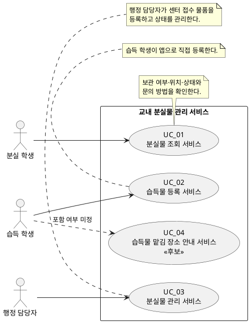

# Use Case 모델 v0.1

| 항목 | 내용 |
|---|---|
| 대상 시스템 | 교내 분실물 관리 서비스 |
| 분석 근거 | `고객 요구사항.md`, `SRS_v0.1.md`, 확정 사항(습득 학생 앱 직접 등록 / 행정 담당자 센터 접수 물품 등록) |
| 분석 관점 | Use Case는 사용자가 달성하려는 목표를 지원하는 **하나의 서비스 단위**로 식별한다. |
| 범위 | 확정된 v0.1 서비스와 범위 결정이 필요한 후보 서비스를 구분한다. |

## 1. 액터 목록

| 액터 | 구분 | 시스템과의 관계 및 목표 | 관련 근거 |
|---|---|---|---|
| 분실 학생 | 주 액터 | 행정실을 방문하기 전에 잃어버린 물품의 보관 여부·위치·상태와 문의 방법을 확인한다. | NEEDS_1, NEEDS_4 |
| 습득 학생 | 주 액터 | 습득한 물품 정보를 앱으로 바로 등록한다. | DEC_00, FR_07 |
| 행정 담당자 | 주 액터 | 분실물 센터로 접수된 습득 물품을 등록하고 보관·인도 상태를 관리한다. | NEEDS_2, NEEDS_3, NEEDS_7, DEC_01 |
| 정보보호 담당자 | 이해관계자 | 조회 정보의 공개 범위를 검토·승인한다. 현재 시스템 내 직접 수행 서비스는 정의되지 않았다. | S4, Pol_00, Pol_08 |
| 서비스 운영 책임자 | 이해관계자 | 담당 부서, 문의 방법, 역할별 권한과 운영 정책을 결정한다. 현재 시스템 내 직접 수행 서비스는 정의되지 않았다. | Pol_07, Pol_08 |

## 2. Use Case 목록

| ID | Use Case(서비스 단위) | 액터 | 사용자 목표(무엇을/왜) | 상태 | 관련 요구사항 |
|---|---|---|---|---|---|
| UC_01 | 분실물 조회 서비스 | 분실 학생 | 보관 여부·위치·상태와 문의 방법을 한 흐름에서 확인하여 불필요한 행정실 방문을 줄이고, 필요한 경우 올바른 경로로 문의한다. | 확정 | FR_00, FR_01, FR_04, FR_05, NEEDS_1, NEEDS_3, NEEDS_4 |
| UC_02 | 습득물 등록 서비스 | 습득 학생 | 습득한 물품 정보를 앱으로 즉시 등록하여 분실물 정보가 조회·관리될 수 있게 한다. | 확정 | FR_07, DEC_00, Pol_09 |
| UC_03 | 분실물 관리 서비스 | 행정 담당자 | 분실물 센터로 접수된 습득 물품을 등록하고, 보관·인도 상태를 관리하여 정확한 물품 현황을 유지한다. | 확정 | FR_02, FR_03, FR_04, NEEDS_2, NEEDS_3, NEEDS_7, DEC_01, Pol_09 |
| UC_04 | 습득물 맡김 장소 안내 서비스 | 습득 학생 | 물건을 직접 맡겨야 하는 경우, 맡김 장소를 확인한다. | 후보(포함 여부 미정) | NEEDS_5, SC4, Pol_05 |

## 3. Use Case Diagram

## 4. 범위에서 제외된 서비스

| 항목 | 제외 사유 | 관련 정책 |
|---|---|---|
| 사진 업로드 및 유사 분실물 검색 | 사진 등록·비교 기능까지 범위가 확대된다. | Pol_03 |
| 사진 매칭 결과 자동 알림 | 수신 정보 등록과 발송 기능이 추가로 필요하다. | Pol_04 |
| 개인 휴대전화 번호 공개 | 개인정보 보호 원칙에 따라 제공하지 않는다. | Pol_00 |
| 학교 계정 인증 | 실제 개인정보·학교 인증 연동은 v0.1 범위에서 제외한다. | Pol_01, Pol_02 |

## 5. 질문 사항

다음 사항은 문서에 결정되지 않았으므로, 서비스의 상세 흐름이나 화면·권한으로 임의 확정하지 않는다.

| ID | 질문 사항 | 관련 Use Case | 결정이 필요한 이유 |
|---|---|---|---|
| Q_01 | 분실 학생은 어떤 조건(예: 물품명, 습득 일자, 분류 등)으로 분실물을 조회해야 하는가? | UC_01 | 조회 입력값과 결과 범위를 정의해야 한다. |
| Q_02 | 조회 결과에서 보관 여부·위치·상태·문의 방법 외에 어떤 정보를 공개할 수 있는가? | UC_01 | 휴대전화 번호 비공개는 확정됐지만, 나머지 공개 항목은 미정이다. |
| Q_03 | 인도 완료된 물품은 분실 학생에게 표시할 것인가? 표시한다면 어떤 정보와 기간으로 표시할 것인가? | UC_01 | 상태별 조회 결과 및 공개 정책을 정의해야 한다. |
| Q_04 | 담당 부서명과 문의 방법으로 무엇을 표시할 것인가? | UC_01 | 실제 표기할 연락 수단·안내 문구가 필요하다. |
| Q_05 | 습득 학생의 앱 직접 등록에 필요한 필수·선택 입력 항목, 등록 후 확인 절차 및 물품 전달 절차는 무엇인가? | UC_02 | 직접 등록 서비스의 입력·후속 처리 흐름을 정의해야 한다. |
| Q_06 | 행정 담당자의 센터 접수 물품 등록에 필요한 필수·선택 입력 항목과 입력 규칙은 무엇인가? | UC_03 | 센터 등록 서비스의 화면과 데이터 검증 기준을 정의해야 한다. |
| Q_07 | 학교 인증 연동 없이 누가 행정 담당자 등록 및 상태 변경을 수행할 수 있는가? | UC_03 | 행정 담당자 식별·접근 통제 방식과 역할별 권한을 결정해야 한다. |
| Q_08 | `보관 중`에서 `인도 완료`로 변경하는 조건은 무엇이며, 오입력 시 누가 어떤 방법으로 정정할 수 있는가? | UC_03 | 상태 전이, 처리 권한 및 정정 절차를 정의해야 한다. |
| Q_09 | 습득물 맡김 장소 안내를 v0.1에 포함할 것인가? 기존 학교 안내를 연결하는 것으로 충분한가? | UC_04 | 후보 서비스의 포함 여부와 구현 범위를 결정해야 한다. |
| Q_10 | 공개 정보의 최종 검토·승인자는 누구이며, 변경 시 승인 절차는 무엇인가? | UC_01 | 정보보호 및 운영 책임을 명확히 해야 한다. |

## 6. Use Case Description

### UC_01 — 분실물 조회 서비스

| 항목 | 내용 |
|---|---|
| ID / 이름 | UC_01 / 분실물 조회 서비스 |
| 상태 / 우선순위 | 확정 / 높음 |
| 사용자와 목표 | **분실 학생**이 보관 여부·위치·상태와 문의 방법을 확인하여 불필요한 행정실 방문을 줄이고, 필요한 경우 올바른 경로로 문의한다. |
| 관련 고객 요구·정책 ID | NEEDS_1, NEEDS_3, NEEDS_4, NEEDS_6, SC1, SC3, SC6, FR_00, FR_01, FR_04, FR_05, Pol_00, Pol_07 |
| 사전조건 | 조회 가능한 분실물 정보가 등록되어 있으며, 공개 정보는 Pol_00의 최소 공개 원칙을 충족한다. |
| 시작 사건 | 분실 학생이 앱에서 분실물 조회를 시작한다. |
| 성공 사후조건 | 허용된 범위의 보관 여부·위치·상태·문의 방법이 표시된다. 조회는 등록 정보를 변경하지 않는다. |
| 실패·취소 사후조건 | 조회 조건이 없거나 결과가 없거나 사용자가 취소해도 등록 정보는 변경되지 않는다. 오류 시에도 비공개 정보는 표시되지 않는다. |
| 미확정 사항·고객 질문 | [논의] Q_01 검색 조건, Q_02 공개 항목, Q_03 인도 완료 물품 표시 범위·기간, Q_04 문의 정보의 실제 표기 내용을 확정해야 한다. |

#### 기본 흐름

| 순서 | 사용자/시스템 행동 |
|---|---|
| 1 | 분실 학생이 분실물 조회 서비스를 선택한다. |
| 2 | 시스템이 조회 조건 입력 방법을 제공한다. [논의] 구체적인 검색 조건은 Q_01에서 확정한다. |
| 3 | 분실 학생이 조회 조건을 입력하고 조회를 요청한다. |
| 4 | 시스템이 등록된 분실물 정보에서 조건에 맞는 항목을 찾는다. |
| 5 | 시스템이 공개 정책에 따라 허용된 보관 여부·위치·상태를 표시한다. |
| 6 | 시스템이 확정된 담당 부서와 문의 방법을 표시한다. |
| 7 | 분실 학생이 결과를 확인하고 서비스를 종료한다. |

#### 대안·예외 흐름

| ID | 분기 지점 | 조건 | 대응 | 복귀 또는 종료 |
|---|---|---|---|---|
| A1 | 3 | 조회 조건이 누락되었거나 형식이 유효하지 않다. | 시스템이 수정이 필요한 입력을 알린다. [논의] 필수 조건·검증 규칙은 Q_01에서 확정한다. | 2로 복귀 또는 취소 종료 |
| A2 | 4 | 일치하는 분실물 정보가 없다. | 시스템이 결과 없음 안내와 담당 부서 문의 방법을 표시한다. [논의] 추가 안내 문구를 결정한다. | 7로 진행 또는 2로 복귀 |
| A3 | 5 | 인도 완료된 물품이 조회된다. | 시스템은 확정된 공개 정책에 따라 표시 여부와 항목을 결정한다. [논의] Q_03 확정 전에는 노출 방식을 확정하지 않는다. | 6으로 진행 또는 해당 항목 미표시 |
| A4 | 5 | 비공개 정보가 결과에 포함될 가능성이 있다. | 시스템이 Pol_00에 따라 비공개 정보를 제외하고 최소 정보만 표시한다. | 6으로 복귀 |
| A5 | 4~6 | 조회 처리 중 오류가 발생한다. | 시스템이 오류를 안내하고 비공개 정보를 표시하지 않는다. [논의] 재시도 방식은 별도 정의가 필요하다. | 2로 복귀 또는 종료 |

### UC_02 — 습득물 등록 서비스

| 항목 | 내용 |
|---|---|
| ID / 이름 | UC_02 / 습득물 등록 서비스 |
| 상태 / 우선순위 | 확정 / 높음 |
| 사용자와 목표 | **습득 학생**이 습득한 물품 정보를 앱으로 직접 등록하여, 물품이 조회·관리될 수 있는 기반을 만든다. |
| 관련 고객 요구·정책 ID | DEC_00, FR_07, NFR_01, Pol_01, Pol_02, Pol_09 |
| 사전조건 | 습득 학생이 앱에 접근할 수 있다. 실제 개인정보와 학교 계정 인증 연동은 사용하지 않는다. |
| 시작 사건 | 습득 학생이 앱에서 습득물 등록을 선택한다. |
| 성공 사후조건 | 습득물 정보가 등록된다. [논의] 등록 직후 공개되는지, 행정 확인 또는 센터 접수 후 공개되는지는 Q_05에서 확정한다. |
| 실패·취소 사후조건 | 등록을 완료하지 않거나 유효성 검증에 실패하면 등록 정보는 생성되지 않는다. [논의] 임시 저장 여부와 보존 기간은 미정이다. |
| 미확정 사항·고객 질문 | [논의] Q_05 직접 등록의 필수·선택 입력 항목, 등록 후 확인 절차 및 물품 전달 절차를 확정해야 한다. 실제 개인정보·인증을 사용하지 않는 경우의 오등록 대응도 결정해야 한다. |

#### 기본 흐름

| 순서 | 사용자/시스템 행동 |
|---|---|
| 1 | 습득 학생이 습득물 등록 서비스를 선택한다. |
| 2 | 시스템이 습득물 정보 입력 양식을 제공한다. [논의] 입력 항목은 Q_05에서 확정한다. |
| 3 | 습득 학생이 습득물 정보를 입력하고 등록을 요청한다. |
| 4 | 시스템이 확정된 입력 규칙에 따라 정보를 검증한다. |
| 5 | 시스템이 검증된 정보를 가상 데이터로 등록한다. |
| 6 | 시스템이 등록 결과와 후속 절차를 안내한다. [논의] 물품 전달 장소·확인 절차·공개 시점은 Q_05에서 확정한다. |
| 7 | 습득 학생이 등록 결과를 확인하고 서비스를 종료한다. |

#### 대안·예외 흐름

| ID | 분기 지점 | 조건 | 대응 | 복귀 또는 종료 |
|---|---|---|---|---|
| B1 | 4 | 필수 정보가 누락되었거나 입력 형식이 유효하지 않다. | 시스템이 수정이 필요한 항목을 표시한다. [논의] 필수 항목·검증 규칙은 Q_05에서 확정한다. | 2로 복귀 또는 취소 종료 |
| B2 | 3~4 | 동일하거나 유사한 물품이 이미 등록되어 있을 수 있다. | [논의] 중복 판정 기준과 안내·차단·허용 방식은 미정이다. 사진 매칭은 Pol_03에 따라 범위 제외다. | 규칙 확정 전까지 처리 방식 미정 |
| B3 | 5 | 등록 저장 중 오류가 발생한다. | 시스템이 등록 실패를 안내하고 성공 여부를 명확히 표시한다. | 2로 복귀 또는 종료; 실패한 등록은 생성되지 않음 |
| B4 | 3 | 습득 학생이 등록을 취소한다. | 시스템이 입력 중인 정보를 폐기한다. [논의] 임시 저장은 별도 요구사항으로 정의해야 한다. | 종료 |
| B5 | 6 | 등록 물품을 실제 센터에 전달해야 한다. | [논의] 전달 필요 여부, 장소 및 증빙·확인 방법은 미정이다. UC_04의 포함 여부와 함께 결정한다. | 안내 후 종료 또는 UC_04로 연결 |

### UC_03 — 분실물 관리 서비스

| 항목 | 내용 |
|---|---|
| ID / 이름 | UC_03 / 분실물 관리 서비스 |
| 상태 / 우선순위 | 확정 / 높음 |
| 사용자와 목표 | **행정 담당자**가 분실물 센터에 접수된 물품을 등록하고 보관·인도 상태를 관리하여, 정확한 현황을 유지하고 반복 문의 부담을 줄인다. |
| 관련 고객 요구·정책 ID | NEEDS_2, NEEDS_3, NEEDS_7, SC2, SC3, DEC_01, FR_02, FR_03, FR_04, NFR_01, NFR_02, NFR_07, Pol_06, Pol_09 |
| 사전조건 | 물품이 분실물 센터에 접수되어 있다. [논의] 행정 담당자 식별·접근 통제 방식은 학교 인증 연동 제외에 따라 Q_07에서 정한다. |
| 시작 사건 | 행정 담당자가 센터 접수 물품을 등록하거나 기존 물품의 보관·인도 상태를 변경해야 한다. |
| 성공 사후조건 | 센터 접수 물품 정보가 등록되거나 대상 물품의 상태가 `보관 중` 또는 `인도 완료`로 기록된다. |
| 실패·취소 사후조건 | 등록 또는 상태 변경이 완료되지 않으면 기존 정보와 상태를 보존한다. [논의] 수정 이력·임시 저장·오류 복구 방식은 Q_06~Q_08에서 확정한다. |
| 미확정 사항·고객 질문 | [논의] Q_06 등록 항목·입력 규칙, Q_07 권한 방식, Q_08 상태 전이 조건·정정 권한·이력 보관 방식을 확정해야 한다. |

#### 기본 흐름 — 센터 접수 물품 등록

| 순서 | 사용자/시스템 행동 |
|---|---|
| 1 | 행정 담당자가 분실물 관리 서비스를 선택하고 센터 접수 물품 등록을 시작한다. |
| 2 | 시스템이 등록 양식을 제공한다. [논의] 필수·선택 항목은 Q_06에서 확정한다. |
| 3 | 행정 담당자가 물품 정보를 입력하고 등록을 요청한다. |
| 4 | 시스템이 확정된 입력 규칙에 따라 정보를 검증한다. |
| 5 | 시스템이 물품 정보를 등록하고 상태를 `보관 중`으로 기록한다. |
| 6 | 시스템이 등록 완료를 표시한다. |

#### 기본 흐름 — 보관·인도 상태 관리

| 순서 | 사용자/시스템 행동 |
|---|---|
| 1 | 행정 담당자가 관리할 등록 물품을 선택한다. |
| 2 | 시스템이 현재 등록 정보와 보관 상태를 표시한다. |
| 3 | 행정 담당자가 필요한 상태 변경을 요청한다. |
| 4 | 시스템이 변경 권한과 상태 전이 조건을 확인한다. [논의] 세부 규칙은 Q_07~Q_08에서 확정한다. |
| 5 | 시스템이 상태를 `보관 중` 또는 `인도 완료`로 기록한다. |
| 6 | 시스템이 변경 결과를 표시한다. |

#### 대안·예외 흐름

| ID | 분기 지점 | 조건 | 대응 | 복귀 또는 종료 |
|---|---|---|---|---|
| C1 | 등록 흐름 4 | 필수 정보가 누락되었거나 형식이 유효하지 않다. | 시스템이 수정 항목을 표시한다. [논의] 검증 규칙은 Q_06에서 확정한다. | 등록 흐름 2로 복귀 또는 취소 종료 |
| C2 | 등록 흐름 3~5 | 이미 등록된 물품과 중복될 가능성이 있다. | [논의] 중복 판정 기준과 병합·별도 등록·수정 절차는 미정이다. | 규칙 확정 전까지 처리 방식 미정 |
| C3 | 상태 관리 4 | 요청자가 상태 변경 권한을 갖지 않는다. | 시스템이 상태 변경을 수행하지 않고 권한 부족을 안내한다. [논의] 권한 부여 방식은 Q_07에서 확정한다. | 상태 관리 1로 복귀 또는 종료 |
| C4 | 상태 관리 4 | `인도 완료` 변경 조건을 충족하지 않거나 허용되지 않은 상태 전이다. | 시스템이 변경을 수행하지 않고 필요한 조치를 안내한다. [논의] 인도 확인 기준과 상태 전이 규칙은 Q_08에서 확정한다. | 상태 관리 2로 복귀 또는 종료 |
| C5 | 상태 관리 5 | 저장 중 오류가 발생한다. | 시스템이 실패를 안내하고 변경 전 상태를 유지한다. | 상태 관리 2로 복귀 또는 종료 |
| C6 | 상태 관리 5 이후 | 상태 변경이 오입력으로 확인된다. | [논의] 정정 권한, 승인 절차, 이력 보관 방식은 미정이다. | Q_08 확정 후 정정 처리 |

### UC_04 — 습득물 맡김 장소 안내 서비스

| 항목 | 내용 |
|---|---|
| ID / 이름 | UC_04 / 습득물 맡김 장소 안내 서비스 |
| 상태 / 우선순위 | 후보(포함 여부 미정) / 미정 |
| 사용자와 목표 | **습득 학생**이 주운 물건을 직접 맡겨야 할 때 맡김 장소를 확인하여 적절한 곳에 물품을 전달한다. |
| 관련 고객 요구·정책 ID | NEEDS_5, SC4, Pol_05 |
| 사전조건 | [논의] 서비스를 v0.1에 포함할지와 기존 학교 안내의 존재 여부를 운영 주체가 결정해야 한다. |
| 시작 사건 | 습득 학생이 습득물 등록 후 또는 별도로 물품을 맡길 장소를 확인하려 한다. |
| 성공 사후조건 | 습득 학생이 확정된 맡김 장소와 안내 방법을 확인한다. |
| 실패·취소 사후조건 | 서비스가 범위에 포함되지 않거나 안내 정보가 확정되지 않은 경우, 시스템은 장소를 확정적으로 안내하지 않는다. |
| 미확정 사항·고객 질문 | [논의] Q_09 서비스 포함 여부와 기존 안내 연결 가능 여부를 결정해야 한다. 실제 장소·운영 시간·예외 상황 안내도 필요하다. |

#### 기본 흐름

| 순서 | 사용자/시스템 행동 |
|---|---|
| 1 | 습득 학생이 습득물 맡김 장소 안내 서비스를 선택한다. |
| 2 | 시스템이 운영 주체가 확정한 맡김 장소와 안내 방법을 표시한다. |
| 3 | 습득 학생이 안내를 확인하고 물품 전달을 준비한다. |

#### 대안·예외 흐름

| ID | 분기 지점 | 조건 | 대응 | 복귀 또는 종료 |
|---|---|---|---|---|
| D1 | 1 | 서비스의 v0.1 포함 여부가 결정되지 않았거나 범위에서 제외됐다. | 시스템은 확정되지 않은 장소를 안내하지 않는다. [논의] 기존 안내 연결 여부는 Q_09에서 결정한다. | 종료 또는 외부 안내로 이동 |
| D2 | 2 | 맡김 장소 정보가 없거나 최신 상태가 아니다. | 시스템은 잘못된 장소를 표시하지 않고 담당 부서 문의 방법을 안내한다. [논의] 최신성 관리 책임자와 갱신 주기는 미정이다. | 종료 또는 UC_01로 연결 |
| D3 | 2 | 습득 학생이 즉시 전달할 수 없는 상황이다. | [논의] 보관 방법, 운영 시간 외 처리, 긴급 물품 처리 정책은 미정이다. | 정책 확정 후 안내 또는 종료 |

## 7. 공통 논의 사항

| ID | 논의 사항 | 영향 Use Case |
|---|---|---|
| D_01 | 습득 학생 직접 등록 정보가 즉시 공개되는지, 행정 담당자 검토 또는 센터 물품 접수 후 공개되는지 결정해야 한다. | UC_01, UC_02, UC_03 |
| D_02 | 습득 학생 직접 등록과 행정 담당자 센터 등록에서 동일 물품이 중복될 때의 식별·처리 규칙을 결정해야 한다. | UC_02, UC_03 |
| D_03 | 실제 개인정보·학교 인증 없이 행정 담당자 권한을 어떻게 통제할지 결정해야 한다. | UC_03 |
| D_04 | 사진 기반 매칭과 자동 알림은 v0.1 범위에서 제외된 상태를 유지한다. | UC_01, UC_02 |
